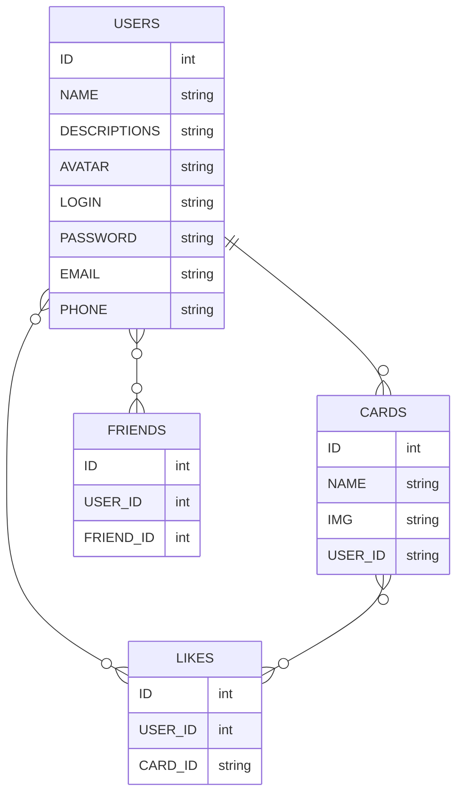

<p align="right">
  <samp>
    🎯 <a href="https://github.com/SinitsaBogdan/yandex-frontend-mesto-project-ff">repository</a>
    📄 <a href="https://sinitsabogdan.github.io/yandex-frontend-mesto-project-ff/pages/home.html">public page</a>
    📚 <a href="https://github.com/SinitsaBogdan/yandex-frontend-mesto-project-ff/wiki">wiki</a>
    📫 <a href="https://github.com/SinitsaBogdan/yandex-frontend-mesto-project-ff/discussions">discussions</a>
    💡 <a href="https://github.com/SinitsaBogdan/yandex-frontend-mesto-project-ff/issues">issues</a>
    💻 <a href="https://github.com/users/SinitsaBogdan/projects/38/views/1">task-board</a>
  </samp>
</p>

# FRONTEND-MESTO-PROJECT-FF

> ## 📜 Описание проета
>
> Lorem ipsum dolor sit amet consectetur adipisicing elit.
> Accusamus vitae ex praesentium deserunt autem, ut veritatis expedita dolore.
> Deleniti obcaecati enim dolores odio quos minus corporis nobis eligendi reprehenderit velit.
>
> #### Что он делает
>
> Lorem ipsum dolor sit amet consectetur adipisicing elit.
> Accusamus vitae ex praesentium deserunt autem, ut veritatis expedita dolore.
> Deleniti obcaecati enim dolores odio quos minus corporis nobis eligendi reprehenderit velit.
>
> #### Какую задачу решает
>
> Lorem ipsum dolor sit amet consectetur adipisicing elit.
> Accusamus vitae ex praesentium deserunt autem, ut veritatis expedita dolore.
> Deleniti obcaecati enim dolores odio quos minus corporis nobis eligendi reprehenderit velit.
>
> #### Какую боль закрывает
>
> Lorem ipsum dolor sit amet consectetur adipisicing elit.
> Accusamus vitae ex praesentium deserunt autem, ut veritatis expedita dolore.
> Deleniti obcaecati enim dolores odio quos minus corporis nobis eligendi reprehenderit velit.

---

> ### 📣 Оглавление
>
> 1. [Описание проекта](#-описание-проета)
> 2. [Структура папок и файлов](#структура-папок-и-файлов)
> 2. [Структура Базы данных](#структура-базы-данных)
> 3. [Инструкция по локальному развертыванию](#-инструкция-по-локальному-развертыванию)
> 4. [Планы и Задачи по доработке проекта](#️-планы-и-задачи-по-доработке-проекта)
> 5. [Баги](#-баги)
> 6. [Команды в проекте](#-команды-в-проекте)
> 7. [История изменений](#-история-изменений)
> 8. [Документация](https://github.com/SinitsaBogdan/yandex-frontend-mesto-project-ff/wiki)

---

> ### Структура папок и файлов

```
├── build                                                       # Сборка проекта
├── node_modules                                                # Библиотеки npm
├── src                                                         # Главная директория проекта
|   ├── blocks                                                  # Компоненты
|   |   ├── buttons                                             # 
|   |   |   └── button.css                                      # 
|   |   ├── card                                                # 
|   |   |   ├── __button                                        # 
|   |   |   ├── __description                                   # 
|   |   |   ├── __image                                         # 
|   |   |   ├── __title                                         # 
|   |   |   └── card.css                                        # 
|   |   ├── content                                             # 
|   |   |   ├── content.css                                     # 
|   |   ├── footer                                              # 
|   |   |   ├── __copyright                                     # 
|   |   |   |     └── footer__copyright.css                     # 
|   |   |   └── footer.css                                      # 
|   |   ├── header                                              # 
|   |   |   ├── __logo                                          # 
|   |   |   |     └── header__logo.css                          # 
|   |   |   └── header.css                                      # 
|   |   ├── page                                                # 
|   |   |   ├── __content                                       # 
|   |   |   |     └── page__content.css                         # 
|   |   |   ├── __section                                       # 
|   |   |   |     └── page__section.css                         # 
|   |   |   └── page.css                                        # 
|   |   ├── places                                              # 
|   |   |   ├── __list                                          # 
|   |   |   |     └── places__list.css                          # 
|   |   |   └── places.css                                      # 
|   |   ├── popup                                               # 
|   |   |   ├── __button                                        # 
|   |   |   |     ├── --disabled                                # 
|   |   |   |     |     └── popup__button-disabled.css *        # 
|   |   |   |     └── popup__button.css                         # 
|   |   |   ├── __caption                                       # 
|   |   |   |     └── popup__caption.css                        # 
|   |   |   ├── __close                                         # 
|   |   |   |     └── popup__close.css                          # 
|   |   |   ├── __content                                       # 
|   |   |   |     └── popup__content.css                        # 
|   |   |   ├── __form                                          # 
|   |   |   |     ├── --field_error *                           # 
|   |   |   |     |     └── popup__form--field_error.css *      # 
|   |   |   |     └── popup__form.css                           # 
|   |   |   ├── __image                                         # 
|   |   |   |     └── popup__image.css                          # 
|   |   |   ├── __input                                         # 
|   |   |   |     ├── --type_error *                            # 
|   |   |   |     |     └── popup__input--type_error.css *      # 
|   |   |   |     └── popup__input.css                          # 
|   |   |   ├── __label                                         # 
|   |   |   |     └── popup__label.css                          # 
|   |   |   ├── __title                                         # 
|   |   |   |     └── popup__title.css                          # 
|   |   |   ├── --is_animated *                                 # 
|   |   |   |     └── popup--is_animated.css *                  # 
|   |   |   ├── --is-opened *                                   # 
|   |   |   |     └── popup--is-opened.css *                    # 
|   |   |   └── popup.css                                       # 
|   |   └── profile                                             # 
|   |       ├── __avatar                                        # 
|   |       |     └── profile__avatar.css                       # 
|   |       ├── __button                                        # 
|   |       |     └── --add                                     # 
|   |       |     |     └── profile__button--add.css.css *      # 
|   |       |     └── --edit                                    # 
|   |       |     |     └── profile__button--edit.css *         # 
|   |       ├── __description                                   # 
|   |       |     └── profile__description.css                  # 
|   |       ├── __image                                         # 
|   |       |     ├── --edit *                                  # 
|   |       |     |     └── profile__image--edit.css *          # 
|   |       |     └── profile__image.css                        # 
|   |       ├── __info                                          # 
|   |       |     └── profile__info.css                         # 
|   |       ├── __title                                         # 
|   |       |     └── profile__title.css                        # 
|   |       └── profile.css                                     # 
|   ├── images                                                  # Изображения в проекте ( стоит отделить растр от вектора )
|   ├── scripts                                                 # Модульные скрипты используемые в проекте
|   |   ├── api.js                                              # Методы API
|   |   ├── card.js                                             # Модуль создания и работы с карточками
|   |   ├── modal.js                                            # Модуль взаимодействия с модальными окнами
|   |   └── validation.js                                       # Модуль валидации форм
|   ├── styles                                                  # Папка для главных файлов стилей
|   |   └── index.css                                           # Подключение стилей для index.css
|   ├── shared                                                  # Папка для общих фалов
|   |   ├── fonts                                               # Хранилище для шрифтов
|   |   ├── fonts.css                                           # Файл подключения шрифтов из папки fonts
|   |   └── normalize.css                                       # Файл сброса стилей
|   ├── webpack                                                 # Папка конфигурационных файлов Webpack
|   |   ├── base.config.js                                      # Файл шаблонной конфигурации Webpack
|   |   ├── constants.js                                        # Константы используемые Webpack
|   |   ├── multipage.config.js                                 # Файл настройки сборки страниц в проекте
|   |   └── plugins.config.js                                   # Плагины используемые в Webpack
|   ├── index.html                                              # Главная страница верстки проекта
|   └── index.js                                                # Главный файл скриптов
├── .gitignore                                                  # Правила игнорирования файлов GitHub
├── .prettierrc                                                 # Конфигурация Prettierrc
├── babel.config.js                                             # Конфигурация Babel
├── package-lock.json                                           # Зависимости в проекте
├── package.json                                                # Конфигурация проекта
├── postcss.config.js                                           # Конфигурация Postcss
├── webpack.config.js                                           # Конфигурация Webpack
└── README.md                                                   # Описание проекта

```
> ### Структура Базы данных

---

> ### 🚀 Инструкция по локальному развертыванию
>
> Lorem ipsum dolor sit amet consectetur adipisicing elit.
> Accusamus vitae ex praesentium deserunt autem, ut veritatis expedita dolore.
> Deleniti obcaecati enim dolores odio quos minus corporis nobis eligendi reprehenderit velit.
> Lorem ipsum dolor sit amet consectetur adipisicing elit.
> Accusamus vitae ex praesentium deserunt autem, ut veritatis expedita dolore.
> Deleniti obcaecati enim dolores odio quos minus corporis nobis eligendi reprehenderit velit.

---

> ### 🤹‍♂️ Планы и Задачи по доработке проекта
>
> Lorem ipsum dolor sit amet consectetur adipisicing elit.
> Accusamus vitae ex praesentium deserunt autem, ut veritatis expedita dolore.
> Deleniti obcaecati enim dolores odio quos minus corporis nobis eligendi reprehenderit velit.
> Lorem ipsum dolor sit amet consectetur adipisicing elit.
> Accusamus vitae ex praesentium deserunt autem, ut veritatis expedita dolore.
> Deleniti obcaecati enim dolores odio quos minus corporis nobis eligendi reprehenderit velit.
> Lorem ipsum dolor sit amet consectetur adipisicing elit.
> Accusamus vitae ex praesentium deserunt autem, ut veritatis expedita dolore.
> Deleniti obcaecati enim dolores odio quos minus corporis nobis eligendi reprehenderit velit.

---

> ### 🐛 Баги
>
> Lorem ipsum dolor sit amet consectetur adipisicing elit.
> Accusamus vitae ex praesentium deserunt autem, ut veritatis expedita dolore.
> Deleniti obcaecati enim dolores odio quos minus corporis nobis eligendi reprehenderit velit.
> Lorem ipsum dolor sit amet consectetur adipisicing elit.
> Accusamus vitae ex praesentium deserunt autem, ut veritatis expedita dolore.
> Deleniti obcaecati enim dolores odio quos minus corporis nobis eligendi reprehenderit velit.

---

> ### 💻 Команды в проекте

> Скачивание и установка библиотек и зависимостей

```
npm run install-lib
```

---

> Локальная сборка проекта в папку build

```
npm run build
```

---

> Локальнаый запуск проекта [localhost:8080](http://localhost:8080/pages/home.html)

```
npm run dev
```

---

> Сборка проекта и публикация на GitHub Pages [localhost:8080](http://localhost:8080/pages/home.html)

```
npm run deploy
```

---

> ### 📦 История изменений
>
> Lorem ipsum dolor sit amet consectetur adipisicing elit.
> Accusamus vitae ex praesentium deserunt autem, ut veritatis expedita dolore.
> Deleniti obcaecati enim dolores odio quos minus corporis nobis eligendi reprehenderit velit.

---
